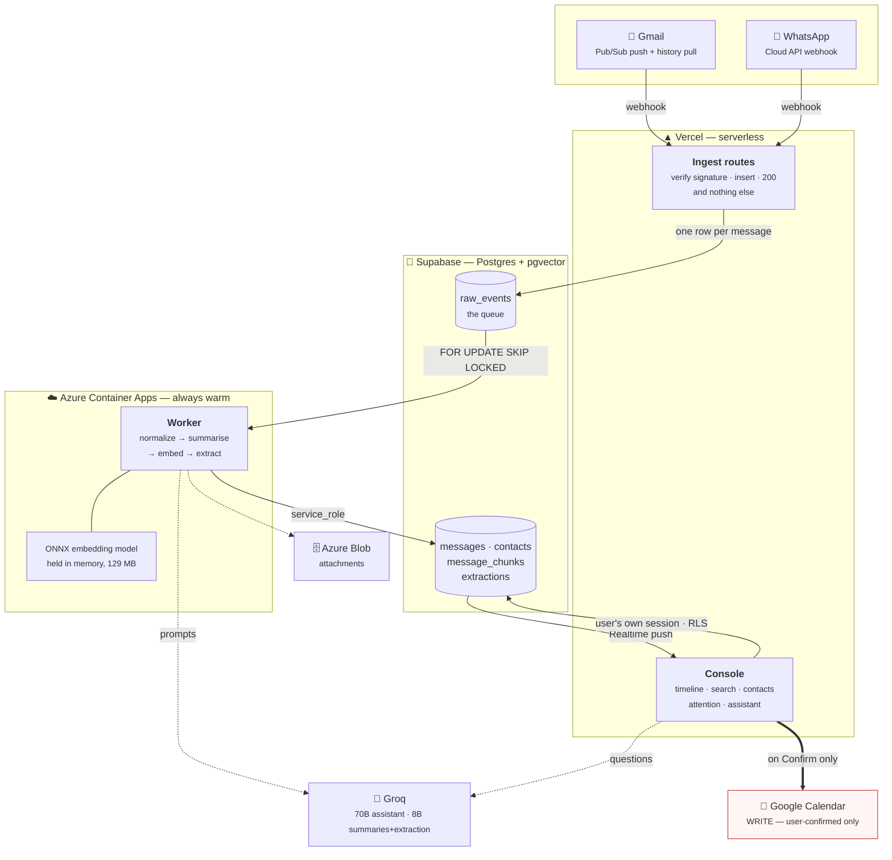
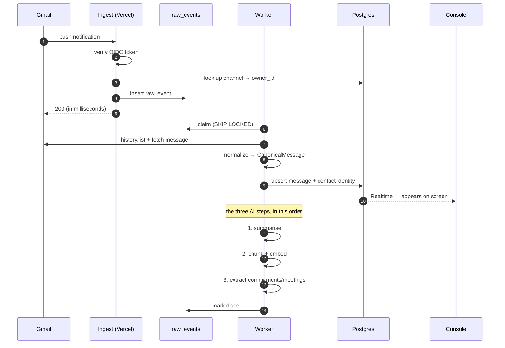
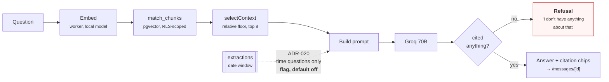
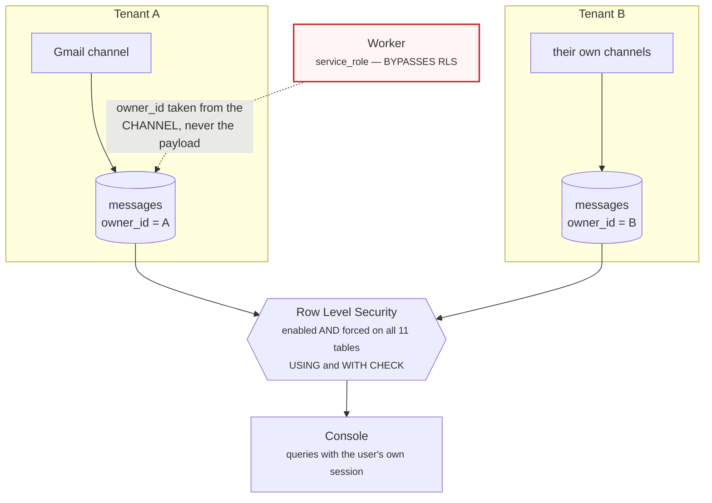

# 07 — Diagrams for the presentation

*Mermaid, so they live in the repo and cannot drift out of sync with the system
the way an exported PNG does. GitHub renders these inline; so does VS Code's
markdown preview.*

**Everything here reflects the system as deployed on 2026-08-03.** If you change
the architecture, change these in the same commit — `AGENTS.md` §4 applies to
diagrams too.

---

## 1. The system, one slide

The diagram to open with. The story it tells: **messages come in from two very
different channels, become one canonical shape, and everything downstream reads
that one shape.**

**The three lines worth saying out loud over this slide:**

1. **Ingest does the absolute minimum.** Verify, insert, return 200. Every
   provider retries a slow webhook and eventually *disables* it, so all the slow
   work happens after the queue. This is the single most important structural
   decision in the system.
2. **The worker is warm on purpose.** It holds a 129 MB embedding model in
   memory. Serverless cannot do that, and a cold-starting container drops
   webhooks — which is exactly why the two halves live on different
   infrastructure.
3. **The red arrow is the only thing that writes outward**, and it only ever
   fires on an explicit human confirmation (ADR-010).

---

## 2. What happens to one message

The slide for *"but what actually happens when mail arrives?"* — and the one
that explains why a summary can be missing without anything being broken.

**⚠ None of steps 11–13 can fail the event.** A summary, an embedding and an
extraction are all *additive* — if Groq is down, the mail still arrives, still
appears, still searches. That is a requirement, not a nicety.

**⚠ The order is deliberate.** Extraction runs last because summaries and
extraction share one 6,000 tokens/minute budget, and if that budget runs out
mid-batch the right thing to lose is the one nobody is looking at yet. The
consequence — that extraction is therefore the step that gets dropped — is why
`extract-catchup.ts` exists to come back for it.

---

## 3. How the assistant answers

The slide behind the demo's step 6. The point to land: **it can only say what
your messages say, and it shows you which ones.**

**⚠ The refusal is the model's job, not a similarity threshold — and that is a
measured finding, not a preference.** ADR-007 originally specified an absolute
floor. Measured on the real corpus, the lowest *answerable* score (0.8487) sat
**below** the highest *unanswerable* one (0.8563): *"recipe for adobo"*
out-scored *"what failed in CI?"*. No threshold separates them. **ADR-016.**

**The number to quote:** the full eval on 2026-08-03 scored **answerable 6/6,
must-refuse 7/7**. Two scores, never one — a combined figure reads identically
for a prompt that refuses everything and one that answers everything.

---

## 4. Multi-tenancy, if anyone asks

The slide for the "is this actually a real system?" question — demo step 8.

**RLS is the security boundary, not defence in depth.** Every table denies by
default and permits only `owner_id = auth.uid()`.

**⚠ The worker is the one place a leak is possible**, because `service_role`
bypasses RLS entirely — so `owner_id` is derived from the channel being
processed and never from anything a provider sent. A CI job asserts the boundary
on every push, and it is negative-controlled: disable RLS on any table and it
exits 1 naming that table.

---

*Last updated 2026-08-03. Diagrams describe the deployed system on that date:
worker revision `--0000015`, migrations at 0011, 496 tests.*
